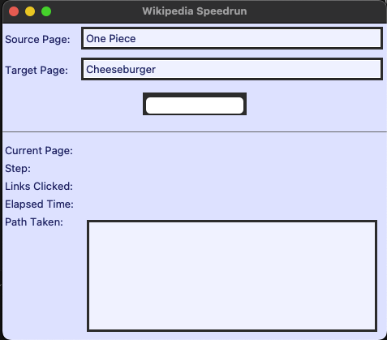
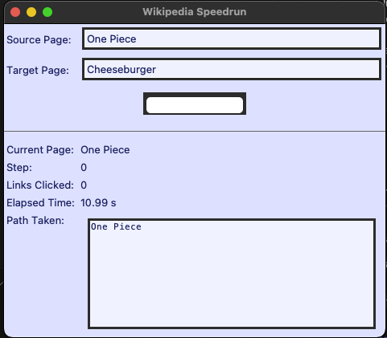
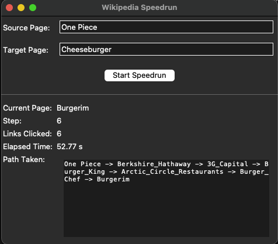
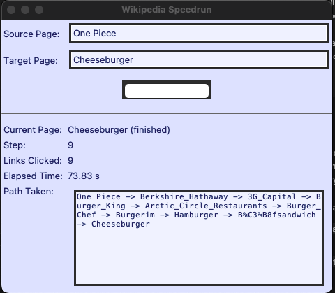

# 📘 Wikipedia SpeedRun AI

AI-powered Wikipedia speedruns using semantic embeddings + a minimal Tkinter GUI.

<p align="center">
  
</p>

---

## 🏷️ Badges

<p align="left">
  
  
  
  
  
  
</p>

---

## 🧠 Overview

This project implements a **Wikipedia speedrunning agent**:

- At each step, it scrapes all outgoing links from the current article.
- It embeds each candidate article using a **SentenceTransformer (MiniLM-L6-v2)**.
- It chooses the next page whose embedding is **closest** to the target page.
- It repeats until it reaches the target or gets stuck.

You can watch it run:

- in a **Tkinter GUI** (live timer, live path, status labels), or  
- in a simple **terminal interface**.

---

## 🖼️ Screenshots

Main GUI:

<p align="center">
  
</p>

Speedrun in progress:

<p align="center">
  
</p>

Live path preview:

<p align="center">
  
</p>

---

## 🚀 Features

- **Semantic navigation**  
  - Each hop is chosen via cosine similarity  
    \[
    \text{next} = \arg\max \cos(\text{embedding(link)}, \text{embedding(target)})
    \]

- **Live GUI**  
  - Current page, step, links clicked  
  - Live timer from start to finish  
  - Path display like:  
    `One_Piece → Burger_King → Hamburger → …`

- **Optimised pipeline**  
  - Batched embedding (single model call per step)  
  - HTML + embedding caching  
  - Target embedding computed once per run  

---

## 📂 Project Structure

```text
SpeedRun/
├── scraping.py        # Wikipedia HTML fetch + link extraction
├── embeddings.py      # SentenceTransformer loading, caching, batched encoding
├── speedrun.py        # Core navigation logic (choose_next_link, speedrun)
├── game_speedrun.py   # Terminal-based live speedrun
├── tk_speedrun.py     # Tkinter GUI with live timer + path
├── assets/            # Screenshots used in README
│   ├── gui_demo.png
│   ├── gui_blue_theme.png
│   ├── gui_running.png
│   └── path_demo.png
└── README.md


⸻

🔧 Installation

python3 -m venv .venv
source .venv/bin/activate
pip install -r requirements.txt

If you don’t have a requirements.txt yet, a minimal one would be:

sentence-transformers
numpy
beautifulsoup4
requests

(Tkinter is included with most Python installs on macOS/Linux.)

⸻

▶️ Running the GUI

python tk_speedrun.py

Then in the window:
	•	Set Source Page (e.g., One Piece)
	•	Set Target Page (e.g., Burger King)
	•	Click Start Speedrun

You’ll see:
	•	Current page
	•	Step number
	•	Links clicked
	•	Elapsed time
	•	The path evolving live in the text box.

⸻

▶️ Running the Terminal Version

python game_speedrun.py

This prints:
	•	current article
	•	number of links clicked so far
	•	elapsed time
	•	final path at the end.

⸻

🧪 Technical Walkthrough

Embeddings
	•	Uses sentence-transformers with all-MiniLM-L6-v2.
	•	For each page:
	•	Fetch HTML via requests
	•	Extract 1–2 intro paragraphs with BeautifulSoup
	•	Encode intro text to a 384-dimensional vector

Batching

Instead of encoding each candidate link separately, links are batched:

embeddings = model.encode(texts, batch_size=32)

This significantly reduces overhead when a page has many links.

Navigation Logic
	1.	Compute target embedding once.
	2.	For current page:
	•	scrape outgoing links
	•	fetch + embed candidates (batched, cached)
	•	compute cosine similarity to target
	•	pick best-scoring link
	3.	Stop when:
	•	target reached
	•	max steps exceeded
	•	or we hit loops / no candidates.

⸻

🧭 Possible Extensions
	•	Beam search or multi-path exploration
	•	Pre-crawled subgraph of Wikipedia in a local DB / graph DB
	•	Streamlit web UI
	•	Visual graph of the path
	•	Heuristics to avoid “topic dead-ends”
	•	Compare greedy vs random vs BFS shortest path

⸻

✍️ Author

Deepanshu Dawande
AI / ML Engineer • LLM Systems & Tooling
